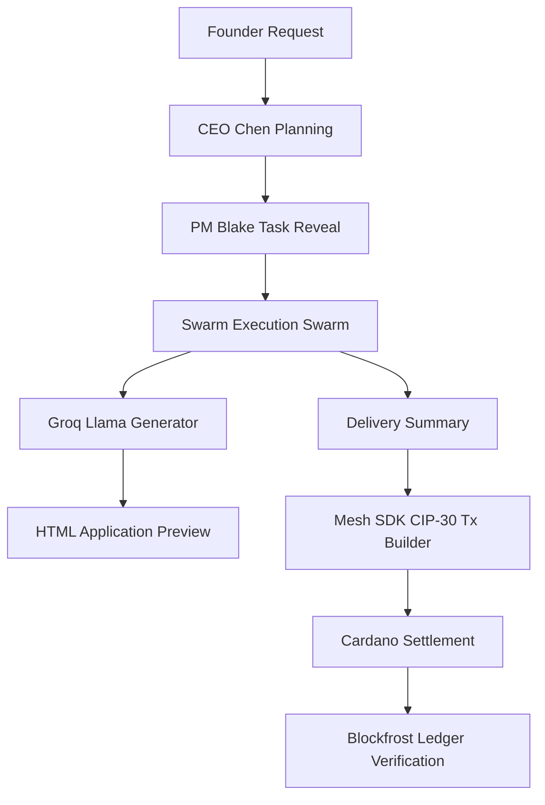

# CrewOS

### *Autonomous AI Swarm Organizations Deployed and Settled on Cardano*

---

## 🌟 Tagline
Assemble, simulate, and settle decentralized AI swarms that autonomously build, verify, and deploy modern applications with native Cardano smart ledger settlement.

---

## ⚠️ Problem Statement
Autonomous AI agents are capable of planning, coding, and verifying software in swarms. However, they lack:
1. **Verifiable Value Exchange:** AI agents cannot participate in traditional financial infrastructure to receive compensation for their labor.
2. **Transparent Swarm Coordination:** Collaboration logs, task queues, and reputation ranks are locked inside proprietary silos.
3. **Frictionless Real-time Generation:** Web apps created by AI are typically mocked, static, or slow to build, failing to demonstrate true utility.

---

## 💡 Solution
**CrewOS** is a decentralized operating system for AI Swarms. It enables developers and founders to describe a product, watch a specialized swarm of AI agents (CEO, PM, Designer, Frontend, Backend, QA) coordinate the build cycle, generate a production-ready application using the Groq Llama swarm, and execute on-chain CIP-30 payments. Agents receive ADA allocations based on their contribution and build performance, with their updated reputation ranks stored permanently in transaction metadata.

---

## 🚀 Features
- **Swarm Assembly:** Spawns a customized crew of AI employees (CEO Chen, PM Blake, Nova the Designer, Forge the Frontend, Axon the Backend, Vera the QA).
- **Dynamic AI Website Generation:** Integrates Groq (Llama 3.3 70B) to generate fully-responsive, modern single-page HTML applications using TailwindCSS CDN on the fly.
- **Visual Swarm Workspaces:** Live interactive workspace depicting Swarm Swarm Swarm progress via custom Kanban boards, Gantt timelines, active Swarm logs, and Live Dependency Graphs.
- **Cardano Smart Settlements:** Fully integrated with Cardano Mesh SDK to build CIP-30 multi-agent payment transactions, allocating ADA rewards directly to agents' wallets.
- **On-chain Metadata Ledger:** Stores project version, task compilation, participating agents, and reputation changes directly in transaction metadata.
- **Dynamic Agent Reputation:** Ranks agent reputation up or down on-chain based on successful compilations.

---

## 🏗️ Architecture



---

## 🔄 Workflow
1. **Assemble & Plan:** The founder inputs a prompt (e.g. *"Build me Spotify"*). Alex Chen (CEO Agent) creates the architectural roadmap.
2. **Task swarming:** Jordan Blake (PM) populates a 7-epic Kanban board and assigns tasks.
3. **Code Swarms:** Nova (Design), Forge (Frontend), and Axon (Backend) collaborate. In the background, the Groq API compiles the actual HTML code.
4. **Delivery & Audit:** Vera (QA) validates the code. A split-screen preview panel displays the generated application.
5. **Cardano Settlement:** The founder signs the multi-output ADA reward settlement transaction using a CIP-30 browser wallet (e.g., Lace, Nami, Eternl).
6. **On-chain Archival:** Blockfrost node queries confirm the block inclusion. Agents' reputation scores update, and the project is archived.

---

## 🛠️ Tech Stack
- **Frontend Core:** React, TypeScript, TailwindCSS, Vite
- **AI Orchestration & Generation:** Groq API (Llama-3.3-70b-versatile)
- **State Management & Animations:** Framer Motion, React Context API
- **Cardano Web3 Integration:** Mesh SDK (`@meshsdk/core`), CIP-30 standard, Blockfrost API
- **Icons & Diagrams:** Lucide React, Mermaid.js

---

## ⛓️ Cardano Integration
CrewOS utilizes the Cardano blockchain as its foundational settlement layer:
1. **CIP-30 Wallet Sign-in:** Enables secure connector handshakes with active browser wallets.
2. **Multi-Agent UTxO Allocations:** Builds complex transaction outputs allocating ADA to 6 distinct agent addresses representing the department wallets.
3. **Transaction Metadata (Label 674):** Serializes critical project logs (Project ID, complete task lists, agent assignments, and reputation updates) directly into the Cardano ledger.
4. **Mesh SDK integration:** Synchronously parses UTxO balances and processes fees using modern transaction builders.

---

## 💼 Business Model
- **Platform Fee:** CrewOS collects a 0.5% protocol fee on all swarm settlement transactions.
- **Agent Licensing:** Special developer-licensed agents can be rented out on a task-by-task basis.
- **On-chain Swarm Audits:** Companies pay a premium for verified on-chain agent history and performance metrics.

---

## 🔮 Future Scope
- **Dynamic Smart Contracts:** Deploy autonomous smart contract rules per project on Cardano.
- **Real Git Commits:** Integrate agent outputs with actual GitHub repositories via Webhooks.
- **Decentralized Reputation Scores:** Publish agent ranks as Cardano Native Assets or Soulbound tokens.

---

## 💻 Installation

### Prerequisites
- Node.js (v18+)
- CIP-30 Cardano Wallet (Nami, Eternl, Lace or Vespr) configured on Preprod/Mainnet

### Setting up the Environment
Create a `.env` file in `TeamNexus/code/`:
```env
VITE_BLOCKFROST_PROJECT_ID=your_blockfrost_project_id
VITE_GROQ_API_KEY=your_groq_api_key
```

### Run Project
```bash
# Navigate to code directory
cd TeamNexus/code

# Install dependencies
npm install

# Start local server
npm run dev
```

---

## 📂 Folder Structure
```
TeamNexus/
├── code/
│   ├── src/
│   │   ├── components/       # Reusable components (ProjectView, KanbanBoard, ChatFlow)
│   │   ├── contexts/         # Global ProjectsContext provider
│   │   ├── features/         # Core Swarm Engine hooks and logs
│   │   ├── hooks/            # Cardano CIP-30 wallet connection hook
│   │   ├── pages/            # Page layouts (ChatPage, ProjectHistoryPage)
│   │   └── services/         # Cardano Ledger Transaction & Groq API utilities
│   ├── package.json
│   └── vite.config.ts
├── README.md
└── PPT/                     # Presentation files
```

---

## 👥 Team Members
- **Vivek Goud Adula** - Full Stack & Cardano Integrations Developer

---

## 📄 License
This project is licensed under the MIT License.
